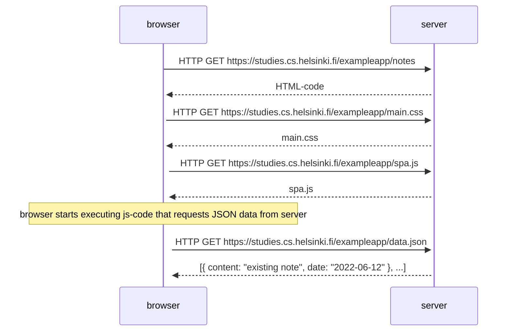

# Solution for part0_0.5
~~Diagram depicting when the user goes to https://studies.cs.helsinki.fi/exampleapp/spa~~

```mermaid
sequenceDiagram
    browser->>+server: HTTP GET https://studies.cs.helsinki.fi/exampleapp/notes
    server-->>+browser: HTML-code
    browser->>+server: HTTP GET https://studies.cs.helsinki.fi/exampleapp/main.css
    server-->>+browser: main.css
    browser->>+server: HTTP GET https://studies.cs.helsinki.fi/exampleapp/spa.js
    server-->>+browser: spa.js
    note over browser:browser starts executing js-code that requests JSON data from server 
    browser->>+server: HTTP GET https://studies.cs.helsinki.fi/exampleapp/data.json
    server-->>+browser: [{ content: "existing note", date: "2022-06-12" }, ...]
```