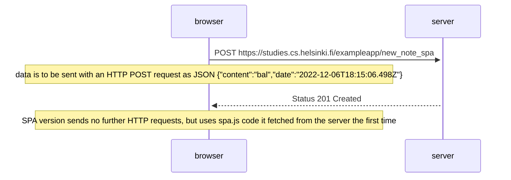

# Solution for part0_0.6
### Diagram depicting when user creates a new note using the SPA verison

```mermaid
sequenceDiagram
    browser->>+server: POST https://studies.cs.helsinki.fi/exampleapp/new_note_spa
    note over browser :data is to be sent with an HTTP POST request as JSON {"content":"bal","date":"2022-12-06T18:15:06.498Z"}
    server-->>+browser: Status 201 Created 
    note over browser : SPA version sends no further HTTP requests, but uses spa.js code it fetched from the server the first time
```